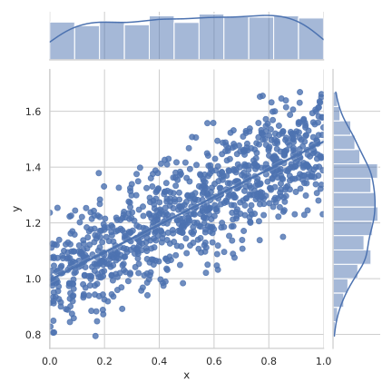

<style> 
  .grid { 
    margin-bottom: 1.5em;
  }
  .grid > * { /* row */
    display: flex;
    flex-wrap: nowrap;
    justify-content: space-between;
    margin-bottom: 1.5em;
  }
  .grid > * > :last-child { /* item */
    white-space: nowrap;
  }
  .grid * {
    line-height: 1.5em;
  }
  .grid > * > *:not(:last-child) { /* item*/
    margin: 0 1em 0 0;
  }
</style>

Piou-piou, a nano PPL 🐤
================================================================================


Pioupiou is a nano probabilistic programming language for Python:
define and simulate probabilistic models, then use the generated data as
you see fit!

<div class="grid">
<div>
<div>**Pioupiou, a nano PPL.**
By Sébastien Boisgérault</div>
<div>[<i class="fa fa-book"></i>](https://boisgera.github.io/pioupiou/)
/
[<i class="fa fa-github"></i>](https://github.com/boisgera/pioupiou)</div>
</div>
</div>


``` python
>>> import pioupiou as pp
>>> X, E = pp.Uniform(0.0, 1.0), pp.Normal(0.0, 0.01)
>>> Y = 0.5 * X + 1.0 + E
>>> omega = pp.Omega(1000) # 1000 samples
>>> x, y = X(omega), Y(omega)
>>> x
array([6.36961687e-01, ..., 3.80007897e-01])
>>> y
array([1.09588258, ..., 1.14366864])
```

<!--

-->


Jacques Harthong -- Probabilités & Statistiques 
================================================================================

I am trying to preserve the open-source book of Jacques Harthong
(coauthor of the famous "[Intuitionnisme 84]" text)
because its sources are  difficult to find on the Internet since his death.
As far as I know, the paperback book is also out of print.

[Intuitionnisme 84]: https://mathinfo.unistra.fr/fileadmin/upload/IREM/Publications/L_Ouvert/n077Reeb/o_77reeb_42-77.pdf

<div class="grid">
<div>
<div>**Probabilités et Statistiques 🇫🇷**</div>
<div>[<i class="fa fa-file-pdf-o"></i>](documents/Harthong - Probabilités et Statistiques.pdf)
/
[<i class="fa fa-github"></i>](https://github.com/boisgera/harthong-prob)</div>
</div>
</div>

How to Become A Bayesian
================================================================================

A nice article to get started with Bayesian data analysis.

<div class="grid">
<div>
<div>**How to become a Bayesian in eight easy steps: An annotated reading list.**
By A. Etz, Q. F. Gronau, F. Dablander,
P. A. Edelsbrunner and B. Baribault</div>
<div>[<i class="fa fa-file-pdf-o"></i>](documents/Etz et al, 8 steps v2.pdf
)
/
[<i class="fa fa-link"></i>](https://dx.doi.org/10.17605/OSF.IO/PH6SW)</div>
</div>
</div>

